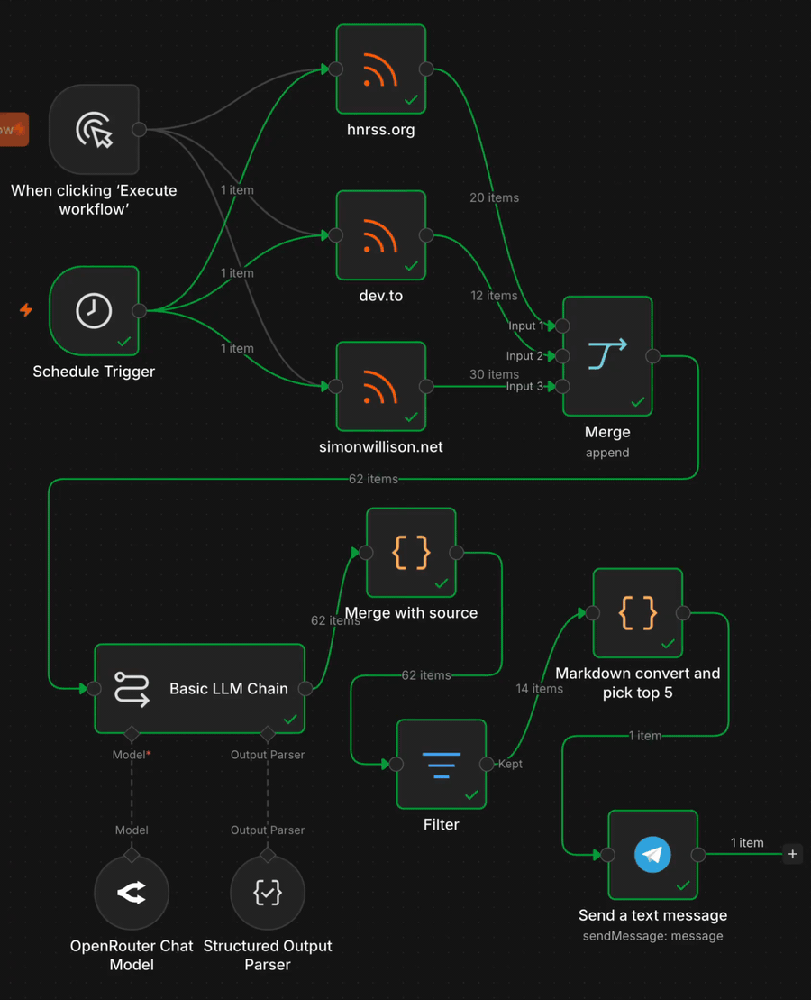

# qualityoflife on n8n

An alternative implementation of one slice of [qualityoflife](../README.md): a weekly tech newsletter digest, scored by an LLM and delivered to Telegram. I built it to find out whether a visual workflow tool can do what the Python pipeline does, and where it does it differently.



**Principle: same problem, two toolkits, side by side so you can read the diff.**

The Python implementation lives in [`agents/`](../agents) and [`scripts/`](../scripts). This directory is the n8n version. Both pull from RSS, score with an LLM, and publish. Where they differ is the wiring, the iteration speed, and what each one does to your thinking while you build.

## Architecture

```
Manual Trigger  ─┐
                 ├─► RSS Read × 3 (HN, dev.to, Simon Willison) ─► Merge (append)
Schedule Trigger ┘                                                    │
                                                                      ▼
                                                              Basic LLM Chain
                                                              ├─ Model: OpenRouter (GPT-4o-mini)
                                                              └─ Output Parser: Structured (JSON)
                                                                      │
                                                                      ▼
                                                              Merge with source (Code)
                                                                      │
                                                                      ▼
                                                              Filter (score ≥ 7)
                                                                      │
                                                                      ▼
                                                              Markdown convert + pick top 5 (Code)
                                                                      │
                                                                      ▼
                                                              Send a text message (Telegram → Hermes chat)
```

See [`screenshots/n8n-workflow.png`](screenshots/n8n-workflow.png) for the live canvas.

## Setup

### 1. Run n8n

This is built and tested on a self-hosted n8n instance behind a Cloudflare Tunnel. No port forwarding, no cloud signup. Same pattern works for n8n Cloud. Adjust the host URLs in the workflow JSON.

```yaml
services:
  cloudflared:
    image: cloudflare/cloudflared:latest
    container_name: cloudflared
    restart: unless-stopped
    command: tunnel run --token ${CF_TUNNEL_TOKEN}

  n8n:
    image: docker.n8n.io/n8nio/n8n:latest
    container_name: n8n
    restart: unless-stopped
    ports:
      - "5678:5678"
    environment:
      - N8N_HOST=n8n.example.com
      - N8N_PROTOCOL=https
      - N8N_PORT=5678
      - WEBHOOK_URL=https://n8n.example.com/
      - N8N_EDITOR_BASE_URL=https://n8n.example.com/
      - N8N_ENCRYPTION_KEY=${N8N_ENCRYPTION_KEY}
      - GENERIC_TIMEZONE=Europe/Helsinki
      - TZ=Europe/Helsinki
      - N8N_RUNNERS_ENABLED=true
      - N8N_BLOCK_ENV_ACCESS_IN_NODE=false
    volumes:
      - ./n8n_data:/home/node/.n8n
```

Both services live in the same Docker Compose stack, so they share the default network and Cloudflared reaches n8n at `http://n8n:5678`. The tunnel itself is set up once on the [Cloudflare Zero Trust dashboard](https://one.dash.cloudflare.com/), and the ingress rule for `n8n.example.com` points to `http://n8n:5678`. With `tunnel run --token`, routing config lives there, not in this file.

Generate the encryption key once and back it up. n8n uses it to encrypt credentials at rest. Lose this key and you lose every saved credential:

```bash
openssl rand -hex 32
```

### 2. Credentials

Create these in **n8n → Credentials**:

- **OpenRouter API**
  - API Key: your OpenRouter key
- **Telegram API**
  - Access Token: your Telegram bot token (BotFather)

### 3. Import the workflow

In n8n: **Workflows → Import from File** → select [`workflow.json`](workflow.json).

Fill in the Chat ID on the Telegram node (your own user ID or a chat where the bot is a member). Verify that the OpenRouter and Telegram credentials are selected on their respective nodes.

### 4. Run

- **Test:** click `Execute Workflow` on the Manual Trigger. The full pipeline runs, the digest is posted to your Telegram chat.
- **Production:** flip the workflow to `Active`. The Schedule Trigger fires every Monday at 08:00 Europe/Helsinki and runs the same pipeline automatically.

## The scoring prompt

Lives in [`prompts/scoring.md`](prompts/scoring.md), versioned separately from the workflow JSON so it can be diffed and reviewed independently. It biases the scorer toward AI-native development, agentic systems, developer tooling, homelab infrastructure, software craftsmanship, and workflow automation platforms.

The prompt is also embedded in workflow.json. The `scoring.md` file is the source of truth, the workflow is the deployment artefact.

## Screenshots

- [`screenshots/n8n-workflow.png`](screenshots/n8n-workflow.png): the canvas, two-band layout with item counts on every edge.
- [`screenshots/workflow-run.gif`](screenshots/workflow-run.gif): one execution from trigger to delivery (LLM scoring stage sped up 3x).
- [`screenshots/telegram-with-context.png`](screenshots/telegram-with-context.png): the digest landing in my Hermes assistant chat alongside other conversation. Agent-to-agent through my daily interface, no separate wiki to context-switch to.

## Notes on the build

A few choices worth flagging if you import this and want to extend it:

- **Truncate after scoring, not before.** Every fetched item is scored. The `Markdown convert and pick top 5` node selects after scoring instead of trimming the input. Earlier versions had a Limit node before the LLM. It took positional first-N from the merged stream and silently dropped entire feeds depending on Merge order. Cost rose roughly 5x when I moved sampling to the destination, which is meaningless at this volume.
- **Source RSS metadata is merged back into the LLM output via a Code node.** The LLM only emits `score`, `reasoning`, `tags`. Title and link come back from `$('Merge').all()` upstream. Avoids round-tripping data through the model.
- **The Telegram message is capped at 4096 characters.** Top 5 by score plus first-sentence reasoning truncation keeps the digest under the limit while staying scannable on a phone.

## Read more

Two writeups (publishing within a few days):

- **Building a tech digest pipeline with n8n.** The construction story, the setup, the 4096-character constraint, the agent-to-agent twist.
- **Three ways to curate your tech digests.** What each approach does to your thinking, a cost comparison across models, and an unexpected third path.
